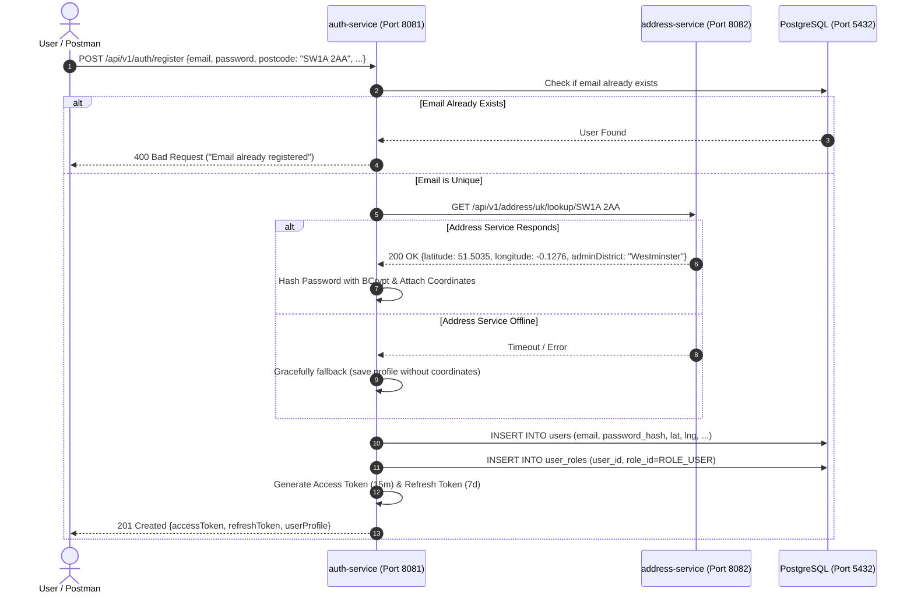
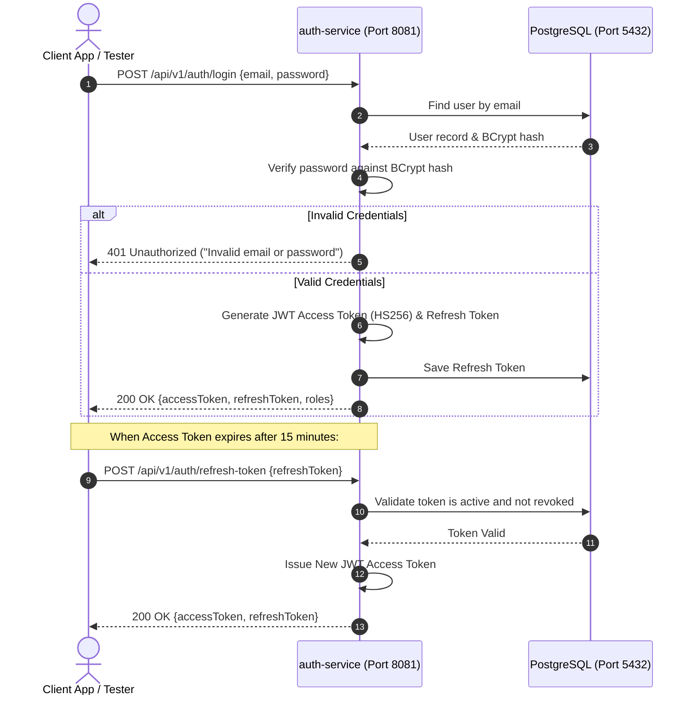
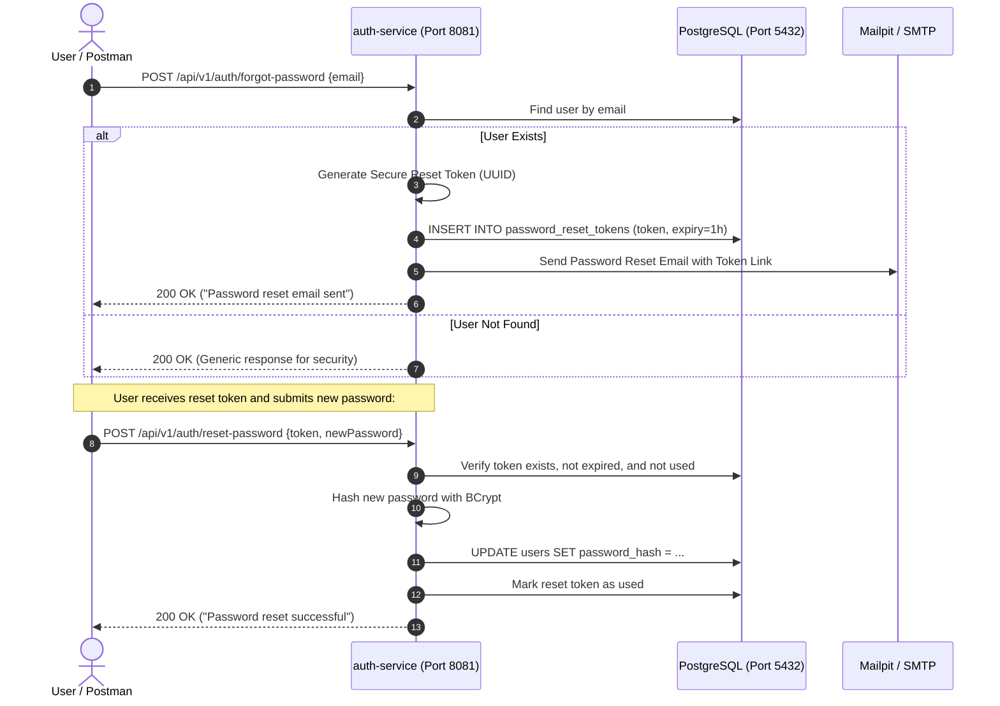

# 📊 Auth Service - Visual Architecture & Workflow Diagrams

This document contains visual Mermaid sequence diagrams detailing the authentication, registration, address enrichment, and password reset flows within **`auth-service`**.

---

## 1. User Registration with UK Address Geocoding Flow

When a new user registers with a UK postcode, `auth-service` calls `address-service` to validate and enrich the user profile with coordinates before saving to PostgreSQL:

---

## 2. Authentication & JWT Token Refresh Flow

---

## 3. Password Reset Workflow

---

## 📑 Next Reading
- 🏛️ [**Architecture & Service Overview**](./SERVICE_OVERVIEW.md)
- 🧪 [**QA & Tester Guide**](./TESTER_GUIDE.md)
- ☁️ [**GCP Deployment Guide**](./GCP_DEPLOYMENT.md)
- 🏠 [**Back to Main README**](../README.md)
